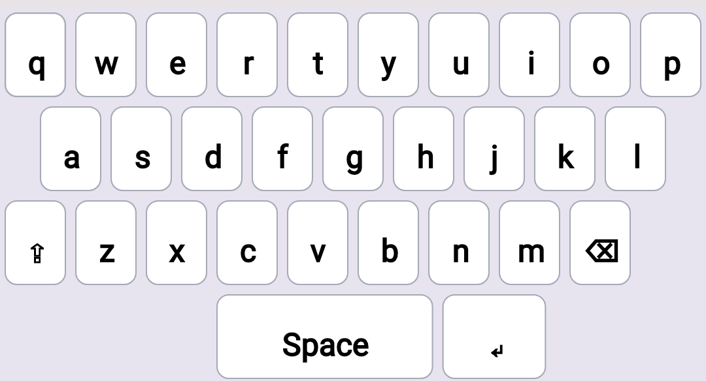

[返回](index.md)

# 如何定制键盘

下图是默认的qwerty键盘布局



Fime 使用**HOCON**格式的配置文件来描述键盘布局，对应的配置文件如下：

```json
// 默认的 qwerty 键盘布局
keyboard {	// 键盘的基本配置信息
  name: qwerty
  height: 576 // px
  keyWidth: 10 // 默认的每一个按键的宽度，屏幕宽度的百分比
  keyHeight: 144 // 默认的每一个按键的高度(px)
  style: {
    background: 0xE3E3E8	// 背景色
  }
}
// 键盘中的按键
keys {
  style: {	// 每一个按键的默认样式，目前支持以下样式
    background: 0xFCFCFE
    border-width: 2
    border-color: 0xA0A8B6
    border-radius: 16  	// px
    margin: [20, 20] 	// 外边距，第一个值表示上下, 第二个值表示左右
    color: 0x000000
    font-size: 48
  }
  items: [		// 按键项
    {name: q}	// name 是按键配置必须的最小配置，其他配置项使用上面的默认值
    {name: w}	// 字母键的 name 就是字母
    {name: e}
    {name: r}
    {name: t}
    {name: y}
    {name: u}
    {name: i}
    {name: o}
    {name: p}
    {move: toNextRow}	// 这不是一个按键配置，这里表示 p 键绘制结束后，移动到下一行的开始
    {move: right, value: 5.0}	// 第二行的 a 键不是“顶格”的，往右移动 5% 的宽度
    {name: a}
    {name: s}
    {name: d}
    {name: f}
    {name: g}
    {name: h}
    {name: j}
    {name: k}
    {name: l}
    {move: toNextRow}	// 同上
    {name: FN_SHIFT}	// 功能键使用 FN_按键名 来表示(使用大写形式)
    {name: z}
    {name: x}
    {name: c}
    {name: v}
    {name: b}
    {name: n}
    {name: m}
    {name: FN_BACKSPACE}
    {move: toNextRow}
    //    {label: "123", width: 30}
    {move: right, value: 30}	// 往右移动 30% 的宽度准备画下一个按键
    {name: SPACE, width: 32}	// 空格键宽度占 32%，而不是默认的 keyWidth
    {name: FN_ENTER, width: 16}	// 回车键宽度占 16%，而不是默认的 keyWidth
  ]
}

```

